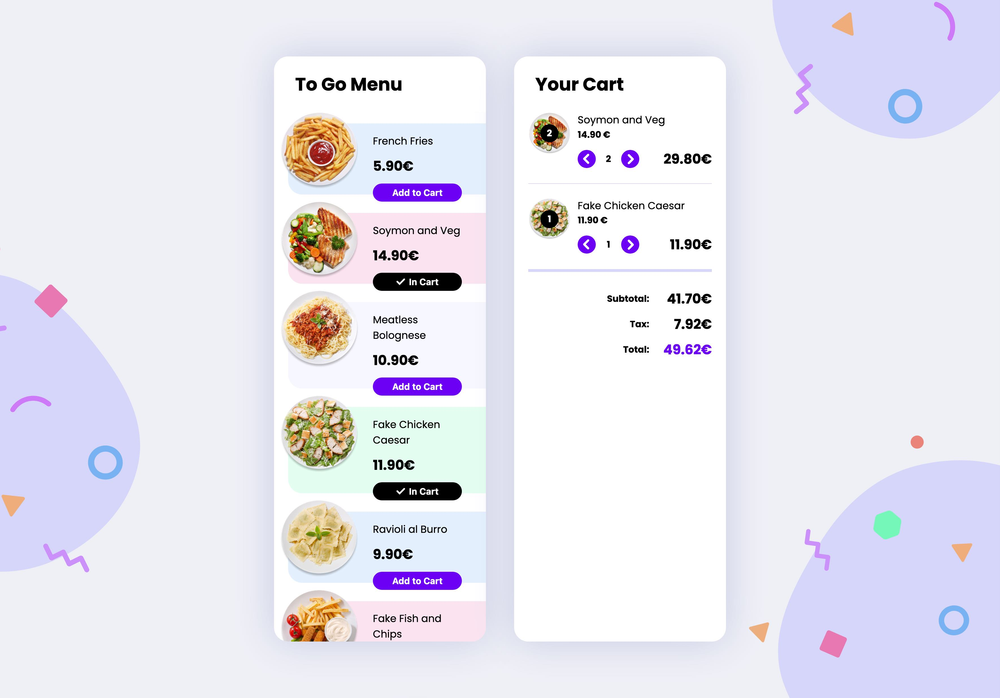

# Advent of CSS/JS 2: Food Cart

A simple web app for selecting and managing items from a food menu, based on an Advent of [CSS](https://www.adventofcss.com)/[JS](https://www.adventofjs.com) challenge.

Written with TypeScript, React, Redux, and Styled Components.

[Deployed here](https://panypticon.github.io/advent2022-2-foodcart/)

